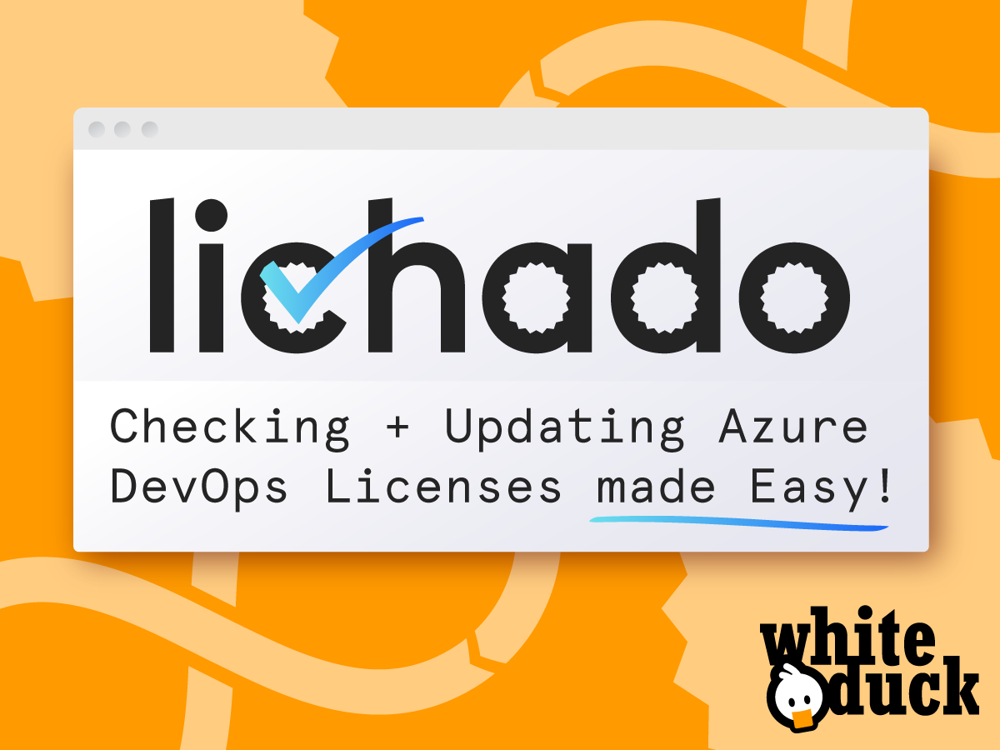
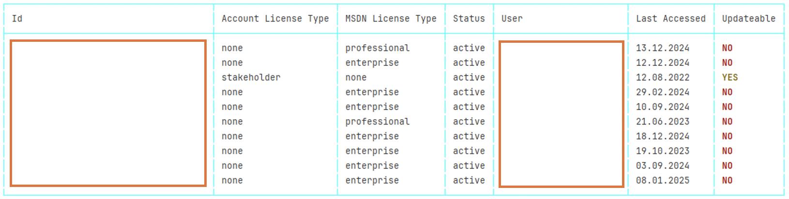
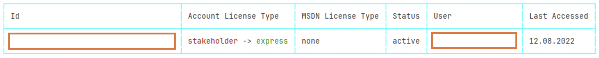

#  &nbsp; `Lichado`: A License Checker for Azure DevOps 





**`Lichado`** helps to check and update licenses for Azure DevOps:

## Collaborate with us 👋

* To report **issues** or search for existing issues go to the 🔎 [**issues tab**](../../issues/).

_And please star this repo ⭐_

## Use Cases

### List Azure DevOps Licenses

```
lichado list --org ORG_NAME --pat PERSONAL_ACCESS_TOKEN
```




### Update Azure DevOps Account License Types from stakeholder to express

```
lichado update --org ORG_NAME --pat PERSONAL_ACCESS_TOKEN --license LIC_FROM --target LIC_TO
```




### Update Azure DevOps Account License Types, but exclude users from updates which are defined in exclude.json

```
lichado update --org ORG_NAME --pat PERSONAL_ACCESS_TOKEN --license LIC_FROM --target LIC_TO --file exclude.json
```

exclude.json:

```json
{
  "Users": ["fred@whiteduck.de", "user01@outlook.de"]
}
```

## Installation

### Homebrew (macOS, Linux)
 - Install `licado` with `brew install whiteducksoftware/tap/licado`
 
### Chocolatey (Windows)`
 - Install `licado` with `choco install licado`

### Binary (Windows, Linux, macOS)
 - Download the latest `licado` binary from [releases](https://github.com/whiteducksoftware/azure-devops-license-checker/releases) 
 - Extract the binary from .tar or .zip file 
 - Add the `licado` binary to your PATH
