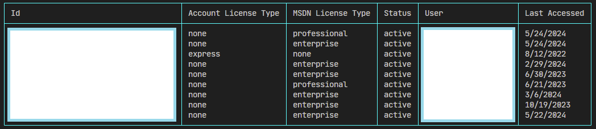
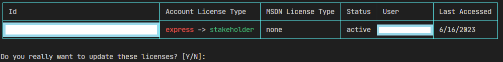

# Azure DevOps License Checker

CLI Tool to check and update licenses for Azure DevOps

## Use Cases

### List Azure DevOps Licenses

```
ado-license list --tenant TENANT_ID --org ORGANIZATION_NAME --pat PERSONAL_ACCESS_TOKEN
```



### Update Azure DevOps Account License Types from express to stakeholder

```
ado-license update --tenant TENANT_ID --org ORGANIZATION_NAME --pat PERSONAL_ACCESS_TOKEN --license express --target stakeholder
```



### Update Azure DevOps Account License Types, but exclude users from updates which are defined in exclude.json

```
ado-license update --tenant TENANT_ID --org ORGANIZATION_NAME --pat PERSONAL_ACCESS_TOKEN --license express --target stakeholder --file exclude.json
```

exclude.json:

```json
{
  "Users": ["fred@whiteduck.de", "user01@outlook.de"]
}
```

### Update Azure DevOps Account License Types, but only if they did not logged in since 100 days

```
ado-license update --tenant TENANT_ID --org ORGANIZATION_NAME --pat PERSONAL_ACCESS_TOKEN --license express --target stakeholder --since 100
```
